# CLAUDE.md

This file provides guidance to Claude Code (claude.ai/code) when working with code in this repository.

## Project Overview

ModernMath is a Mathematics Knowledge Graph Wiki that represents mathematical concepts (axioms, definitions, theorems, examples) as interconnected nodes in a semantic knowledge graph. It uses Quarto for content authoring, RDF/OWL for graph representation, Python for processing, and provides SPARQL querying capabilities.

## Web Interaction Guidelines

- Use MCP tools such as Playwright or Puppeteer when viewing web content.

## Essential Commands

### Development Setup

```bash
# Install dependencies (requires Poetry)
poetry install

# Activate the virtual environment
poetry shell
```

### Building the Knowledge Graph

```bash
# Build the RDF knowledge graph from content files
poetry run python scripts/build_graph.py

# Validate all metadata before building
poetry run python scripts/validate_metadata.py

# Validate the generated graph
poetry run python scripts/validate_graph.py

# Generate comprehensive index pages for all domains
poetry run python scripts/generate_index_pages.py
```

### Generating Visualizations

```bash
# Add click directives to Mermaid diagrams (run before generating)
poetry run python scripts/add_mermaid_links.py

# Generate all visualizations in sequence
poetry run python scripts/generate_mermaid.py
poetry run python scripts/generate_pyvis.py
poetry run python scripts/generate_d3_data.py
poetry run python scripts/insert_diagrams.py
```

### Site Development

```bash
# Preview the site locally
quarto preview

# Build the complete site
quarto render

# Build with language profiles (for multilingual support)
quarto render --profile en  # Uses _quarto-en.yml automatically
quarto render --profile ja  # Uses _quarto-ja.yml automatically

# Build search index
poetry run python scripts/build_search_index.py
```

### Managing Translations

```bash
# Update translation status for all files
poetry run python scripts/manage_translations.py update

# Generate translation progress report
poetry run python scripts/manage_translations.py report

# List files by translation status
poetry run python scripts/manage_translations.py list --status=not_started
poetry run python scripts/manage_translations.py list --status=needs_update

# Validate translation metadata consistency
poetry run python scripts/manage_translations.py validate

# Show domain-by-domain statistics
poetry run python scripts/manage_translations.py stats
```

**Translation Status Categories:**

- `not_started`: No translation file exists
- `in_progress`: Translation file exists but marked incomplete
- `completed`: Translation finished and verified
- `needs_update`: Source changed after translation

The system uses MD5 hashes to detect content changes and automatically updates status in `translations-status.yml`. Translation edges are added to the RDF graph as `hasTranslation` relationships.

### Code Quality

```bash
# Format code
poetry run black scripts/

# Run linting
poetry run flake8 scripts/ --max-line-length=100 --extend-ignore=E203,W503,W293

# Type checking
poetry run mypy scripts/
```

### SPARQL and API

```bash
# Start Fuseki SPARQL endpoint
cd fuseki/scripts && ./start_fuseki.sh

# Start REST API
cd api && ./start_api.sh  # Runs on http://localhost:5001/
```

## Architecture Overview

### Content Structure

All mathematical content is in `content/` organized by domain. Each `.qmd` file represents a node in the knowledge graph with:

- **YAML Front Matter**: Contains metadata (id, type, status, requires)
  - **type**: Must be one of: `Corollary`, `Definition`, `Theorem`, `Example`, `Axiom`, `Proposition`, `Lemma` (capitalized)
  - **status**: Must be one of: `verified`, `stub`, `complete`, `draft`
- **Cross-References**: Use `@label` syntax to create graph edges
- **File Naming**: `def-*.qmd`, `thm-*.qmd`, `ex-*.qmd`, `ax-*.qmd`

### Processing Pipeline

1. **Content Parsing** (`scripts/build_graph.py`):
   - Reads `.qmd` files using `python-frontmatter`
   - Extracts metadata and cross-references
   - Builds RDF triples using `rdflib`

2. **Visualization Generation**:
   - **Mermaid**: Static diagrams for each node's local neighborhood
   - **PyVis**: Interactive HTML visualizations (force-directed graphs)
   - **D3.js**: JSON data for client-side rendering

3. **Cross-Reference Resolution** (`scripts/resolve_cross_references.py`):
   - Handles inter-domain references
   - Updates relative paths in generated HTML

### Knowledge Graph Schema

The ontology (`ontology/math-ontology.ttl`) defines:

- **Node Types**: Axiom, Definition, Theorem, Example
- **Relationships**: uses, hasExample, generalizes, implies
- **Mapped to**: OntoMathPRO and SKOS for interoperability

### Key Integration Points

- **Quarto Filter**: `_extensions/graph-viz/` for embedding visualizations
- **GitHub Actions**: Automated build/test/deploy pipeline
- **Fuseki**: SPARQL endpoint for graph queries
- **Flask API**: REST interface for common queries

### Visualization Troubleshooting

#### Interactive Visualization Path Issues

If interactive visualizations (D3/PyVis) fail to load due to path issues, the graph-viz extension needs to calculate relative paths dynamically. For GitHub Pages deployments with project subdirectories:

```javascript
// In _extensions/graph-viz/graph-viz.lua
// Calculate relative path based on current location
const currentPath = window.location.pathname;
const pathParts = currentPath.split("/").filter((p) => p);

// For GitHub Pages with project name subdirectory
if (window.location.hostname.includes("github.io") && pathParts.length > 0) {
  // Remove project name from depth calculation
  const depthFromProjectRoot = pathParts.slice(1).length - 1;
  basePath = "../".repeat(depthFromProjectRoot);
} else {
  // For local development or root deployment
  const depth = (currentPath.match(/\//g) || []).length - 1;
  basePath = "../".repeat(depth);
}

const response = await fetch(basePath + "output/d3-data/%s.json");
```

This ensures visualizations load correctly from any nested directory level, accounting for GitHub Pages project subdirectories (e.g., `/ModernMath/ja/content/ja/algebra/`).

#### Making Mermaid Diagrams Clickable

To enable navigation from Mermaid diagram nodes, add click directives:

```mermaid
graph TD
    def-group["定義: 群"]:::definition
    def-binary-operation["定義: 二項演算"]:::definition
    def-group --> def-binary-operation
    click def-group "def-group.html" "群の定義へ"
    click def-binary-operation "def-binary-operation.html" "二項演算の定義へ"
```



Format: `click node-id "relative-path.html" "tooltip-text"`

#### Automating Mermaid Clickable Links

The `scripts/add_mermaid_links.py` script automatically adds click directives to all Mermaid diagrams:

```bash
# Add click directives to all Mermaid diagrams
poetry run python scripts/add_mermaid_links.py
```

Features:

- Detects all node references in Mermaid diagrams (def-_, thm-_, ex-_, ax-_)
- Adds appropriate click directives with language-aware tooltips
- Skips nodes that already have click directives
- Skips the current node (marked with 'current' class)
- Handles both English and Japanese tooltips automatically

This script is integrated into the build pipeline and runs before Mermaid diagram generation.

#### Preventing Duplicate Graph Visualizations

The graph-viz extension can automatically insert D3-based visualizations on pages with node IDs. To prevent duplicate graphs on pages that already have Mermaid diagrams:

- **Issue**: Pages with existing Japanese Mermaid diagrams were getting additional English D3 graphs auto-inserted
- **Cause**: The graph-viz extension's `Pandoc` function was automatically adding visualizations based on page metadata
- **Solution**: Remove or disable automatic insertion logic in `_extensions/graph-viz/graph-viz.lua`
- **Prevention**: The `insert_diagrams.py` script checks for existing graphs including:
  - English headers: "Dependency Graph", "Local Graph"
  - Japanese headers: "依存関係グラフ", "局所依存関係グラフ"
  - Any existing Mermaid code blocks

**Important**: When creating multilingual sites, ensure visualization generation scripts respect the language context and don't insert duplicate content.

## Multilingual Support

The project supports multiple languages (currently English and Japanese) with automatic language detection and routing.

### Content Structure

- **Language Directories**: `content/en/` for English, `content/ja/` for Japanese
- **Language Profiles**: `_quarto-en.yml` and `_quarto-ja.yml` define language-specific configurations
- **Translation Links**: Each page includes `translations` field in YAML front matter linking to its translations
- **Domain Metadata**: Each domain requires `_metadata.yml` with translated domain name (e.g., `domain: "代数学"` for algebra)

### Translation Implementation Details

When creating translations:

- **Translation Metadata Fields**: Japanese translation files require two metadata fields:

  ```yaml
  # Required in Japanese files (points to .qmd)
  translation_of: ../../en/algebra/def-group.qmd

  # Required in both English and Japanese files (point to .html)
  translations:
    en: "../en/algebra/def-group.html"
    ja: "../ja/algebra/def-group.html"
  ```

- **Path Format Distinction**:
  - `translation_of`: Points to source .qmd file (used for tracking)
  - `translations`: Points to output .html files (used for navigation)

- **Translation Field Requirements**:
  - All translation files must have both `en` and `ja` entries in the `translations` field
  - The `translations` field must be a dictionary, not a string or list
  - Some geometry files may have non-dictionary translation fields that need correction

- **Cross-References**: Keep internal references as `.qmd` extensions

  ```markdown
  See [群の定義](def-group.qmd) for details # Correct
  ```

- **Standard Japanese Mathematical Terms**:
  - Group → 群 (gun)
  - Ring → 環 (kan)
  - Field → 体 (tai)
  - Vector Space → ベクトル空間
  - Topology → 位相幾何学
  - Category → 圏 (ken)
  - Morphism → 射 (sha)
  - Functor → 関手 (kanshu)

### Building Multilingual Sites

```bash
# Build both language versions
quarto render --profile en
quarto render --profile ja

# Fix Japanese index page (copies index-ja.html to index.html)
poetry run python scripts/fix_japanese_index.py

# Or use the convenience script that includes all steps
./build-multilingual.sh

# Note: The CI/CD uses the unified build.yml workflow
```

**Important**: The Japanese site requires a post-build fix because Quarto generates `index.html` from `index.qmd` (English content) by default. The `fix_japanese_index.py` script copies `index-ja.html` to `index.html` in the Japanese output directory to ensure the correct content is displayed.

### Quarto Configuration Merging

**Important**: Quarto merges profile configurations with the base `_quarto.yml` rather than replacing them. To avoid duplicate navigation items in multilingual setups:

- Keep the base `_quarto.yml` minimal (only shared configuration like favicon, GitHub links)
- Define complete navbar configurations in each language profile (`_quarto-en.yml`, `_quarto-ja.yml`)
- Do not include language-specific navigation items in the base configuration
- Ensure all 9 mathematical domains are included in both language navbar configurations

### Python Script Compatibility

All Python scripts handle multilingual paths automatically:

- Scripts detect `content/lang/domain/` structure
- Domain extraction logic accounts for language directories
- Falls back to flat structure for backward compatibility
- `generate_index_pages.py` generates language-specific content:
  - Uses Japanese domain names and descriptions when `lang="ja"`
  - Translates section headers (定義, 定理, 例) for Japanese
  - Adjusts navigation links to language-specific pages

### CI/CD Pipeline

The project uses a unified `build.yml` workflow:

1. Builds both language versions sequentially
2. Fixes Japanese index page using `scripts/fix_japanese_index.py`
3. Creates a root `index.html` with automatic language detection
4. Deploys both versions to `_site/en/` and `_site/ja/`
5. Includes .nojekyll file for GitHub Pages compatibility

**Important**: Maintain a single workflow file to avoid redundancy. The build.yml workflow handles all multilingual builds - there's no need for separate language-specific workflows.

### Language Detection

Root index.html provides both automatic detection and manual selection:

- Automatic redirect based on browser language preference
- Manual language selection with flag buttons (🇬🇧/🇯🇵)
- Saves user preference in localStorage for future visits
- Provides visual loading feedback during auto-detection

### Japanese Navigation Pages

When implementing Japanese support, create these navigation pages with `-ja.qmd` suffix:

- `index-ja.qmd` - Japanese home page (referenced in `_quarto-ja.yml` navbar)
- `search-ja.qmd` - Japanese search interface
- `visualizations-ja.qmd` - Japanese visualizations page
- `about-ja.qmd` - Japanese about page
- `contributing-ja.qmd` - Japanese contributing guide

Update `_quarto-ja.yml` navbar to reference these files and ensure all domain links use Japanese paths (e.g., `../../search-ja.qmd` instead of `../../search.qmd`).

### Translation Management System

The project uses a hash-based change detection system to track translation status:

- **Status Tracking**: `translations-status.yml` maintains translation status for all content files
- **Change Detection**: MD5 hashes of content (excluding front matter) detect when source files change
- **Status Categories**: `not_started`, `in_progress`, `completed`, `needs_update`
- **Management Script**: `scripts/manage_translations.py` provides commands:
  - `update`: Scan files and update translation status
  - `report`: Generate translation progress reports
  - `list --status=X`: List files with specific status
  - `validate`: Check front matter consistency
  - `stats`: Show domain-by-domain statistics
- **Integration**: Translation edges are added to the RDF graph as `hasTranslation` relationships

#### Implementation Details

- **RDF Integration**: The `translation_graph.py` module is imported in `build_graph.py` and `add_translation_edges()` is called in the `_save_graph()` method when `translations-status.yml` exists
- **Pre-commit Behavior**: The `update-translation-status` hook shows as "failed" when it modifies files - this is expected behavior and ensures the status file stays current
- **Quarto Extension**: Translation status badges use the `_extensions/translation-status/` extension with Lua shortcodes (e.g., ``)
- **Testing Pattern**: Dynamic imports in tests use `# pylint: disable=import-error,wrong-import-position` to handle script imports

#### Pre-commit Hook Timestamp Updates

The translation management system avoids unnecessary file modifications:

- **Issue**: Pre-commit hooks can't commit `translations-status.yml` if it's always updated with new timestamps
- **Solution**: `manage_translations.py` compares data structures (excluding timestamps) before saving
- **Implementation**:
  - `save_status_file()` accepts optional `update_timestamp` parameter
  - Only updates `last_updated` and `translated_at` when content actually changes
  - Uses deep copy comparison excluding timestamp fields
- **Result**: Pre-commit hooks only modify files when there are real translation status changes

## Critical Implementation Details

### CI/CD Script Exit Codes

**Important**: Scripts in the CI/CD pipeline should return exit code 0 when no changes are needed. In CI/CD contexts, "no changes required" is a normal success case, not an error. For example, `add_mermaid_links.py` correctly returns 0 whether files were modified or not.

### Cross-Reference Format

When referencing concepts across domains, the resolver transforms paths:

```text
@algebra/def-group → ../algebra/def-group.html
```

### Visualization Data Structure

PyVis graphs include:

- Node positioning via force-directed layout
- Color coding by type (Definition=green, Theorem=blue, etc.)
- Hover information with titles and types

### Build Order Dependencies

1. First: `build_graph.py` (creates knowledge_graph.ttl)
2. Then: `add_mermaid_links.py` (adds click directives to Mermaid diagrams)
3. Then: Visualization scripts (read the .ttl file)
4. Then: `generate_index_pages.py` (creates comprehensive index pages with language support)
5. Then: `resolve_cross_references.py` (needs content to exist)
6. Finally: `quarto render` (uses all generated assets)

## Current Status

- **Content**: 101 nodes across 9 mathematical domains
- **Translations**: 101/101 (100%) Japanese translations with automated status tracking
- **Graph**: 276+ RDF triples with full dependency tracking and translation edges
- **Visualizations**: 80 interactive graphs deployed
- **API**: RESTful endpoints for node queries and dependencies
- **CI/CD**: Full automation via GitHub Actions with translation validation
- **Translation Management**: Fully implemented with MD5 hash-based change detection and pre-commit hooks

## Next Phase: Lean Integration

The project is designed for future integration with Lean 4:

- `lean_id` field in YAML for mapping to formal proofs
- Planned LeanDojo integration for dependency extraction
- Verification workflow to compare formal/informal graphs
