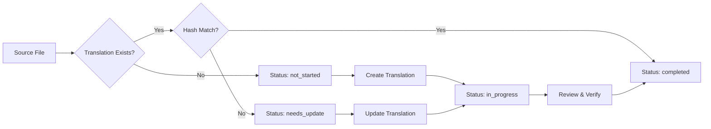

# Translation Management System Design

## Overview

This document outlines a comprehensive system for managing translations of mathematical content articles between English and Japanese in the ModernMath Knowledge Graph Wiki.

## Goals

1. Track translation status for all content files
2. Detect when source content changes require translation updates
3. Provide clear visibility into translation progress
4. Automate translation workflow where possible
5. Maintain consistency between language versions

## Core Components

### 1. Translation Status Tracking File

**File**: `translations-status.yml`

```yaml
# Translation status for ModernMath content
# Generated and updated by scripts/manage_translations.py

metadata:
  last_updated: 2025-01-20T10:00:00Z
  source_language: en
  target_languages: [ja]

translations:
  algebra/def-group.qmd:
    source_hash: "abc123..." # MD5 hash of English content
    translations:
      ja:
        status: completed # not_started | in_progress | completed | needs_update
        translated_at: 2025-01-15T10:00:00Z
        translated_hash: "def456..." # Hash at time of translation
        translator: "username"
        notes: "Technical terms verified"

  algebra/def-field.qmd:
    source_hash: "ghi789..."
    translations:
      ja:
        status: in_progress
        started_at: 2025-01-18T10:00:00Z
        translator: "username"
        notes: "Working on examples section"
```

### 2. Translation Management Script

**File**: `scripts/manage_translations.py`

Key features:

- Scan all content files and update status
- Detect changes in source files (hash comparison)
- Generate translation reports
- Mark files needing updates
- Validate translation completeness

### 3. Status Categories

1. **not_started**: No translation file exists
2. **in_progress**: Translation file exists but marked incomplete
3. **completed**: Translation finished and verified
4. **needs_update**: Source changed after translation

### 4. Automated Detection Rules

The system automatically detects:

1. **Missing Translations**: Source file exists but target doesn't
2. **Outdated Translations**: Source file hash changed after translation
3. **Orphaned Translations**: Translation exists but source deleted
4. **Metadata Mismatches**: Front matter inconsistencies

### 5. Translation Workflow



## Implementation Details

### File Structure Convention

```text
content/
├── en/                    # Source language
│   └── algebra/
│       └── def-group.qmd
└── ja/                    # Target language
    └── algebra/
        └── def-group.qmd  # Same filename
```

### Front Matter Requirements

Each translated file must include:

```yaml
---
title: "群" # Translated title
id: group
type: Definition
translations:
  en: ../../../en/algebra/def-group.qmd
  ja: ../../../ja/algebra/def-group.qmd
translation_of: en/algebra/def-group.qmd
translation_status: completed
---
```

### Command Line Interface

```bash
# Update translation status
poetry run python scripts/manage_translations.py update

# Generate translation report
poetry run python scripts/manage_translations.py report

# List files needing translation
poetry run python scripts/manage_translations.py list --status=not_started

# List outdated translations
poetry run python scripts/manage_translations.py list --status=needs_update

# Validate all translations
poetry run python scripts/manage_translations.py validate

# Generate translation statistics
poetry run python scripts/manage_translations.py stats
```

### Report Formats

#### Summary Report

```text
Translation Status Summary
========================
Total source files: 85
Languages: en (source) → ja

Japanese (ja):
- Completed: 45 (52.9%)
- In Progress: 10 (11.8%)
- Needs Update: 5 (5.9%)
- Not Started: 25 (29.4%)

Domains with incomplete translations:
- topology: 0/11 (0%)
- probability-statistics: 2/9 (22.2%)
```

#### Detailed Report (CSV)

```csv
source_file,target_lang,status,last_updated,translator,notes
algebra/def-group.qmd,ja,completed,2025-01-15,user1,"Verified"
algebra/def-field.qmd,ja,needs_update,2025-01-10,user2,"Source changed"
```

## Integration Points

### 1. Build Pipeline Integration

Add to `scripts/build_graph.py`:

- Validate translation references
- Include translation edges in RDF graph
- Generate translation status badges

### 2. CI/CD Validation

GitHub Actions workflow:

```yaml
- name: Check Translation Status
  run: |
    poetry run python scripts/manage_translations.py validate
    poetry run python scripts/manage_translations.py report --format=github
```

### 3. Visual Indicators

Add to Quarto templates:

- Translation status badges
- "View in other languages" links
- Outdated translation warnings

### 4. SPARQL Queries

Enable queries like:

```sparql
# Find all untranslated theorems
SELECT ?theorem WHERE {
  ?theorem rdf:type :Theorem .
  FILTER NOT EXISTS {
    ?theorem :hasTranslation ?translation .
    ?translation :language "ja" .
  }
}
```

## Maintenance Tools

### Translation Dashboard

Web interface showing:

- Overall translation progress
- Per-domain completion rates
- Recent translation activity
- Files needing attention

### Batch Operations

```bash
# Mark domain as fully translated
manage_translations.py mark-completed --domain=algebra --lang=ja

# Assign translator to multiple files
manage_translations.py assign --files="topology/*.qmd" --translator=user3

# Export for external translation
manage_translations.py export --format=xliff --status=not_started
```

## Best Practices

1. **Atomic Translations**: Translate complete files, not partial content
2. **Preserve Structure**: Maintain identical file organization across languages
3. **Version Tracking**: Use git commits to track translation history
4. **Regular Updates**: Run status checks weekly to catch drift
5. **Translator Notes**: Document domain-specific terminology decisions

## Future Enhancements

1. **Machine Translation Integration**: Pre-translate with AI, human verify
2. **Diff Visualization**: Show exactly what changed in source
3. **Translation Memory**: Reuse common phrases/definitions
4. **Crowdsourcing**: Allow community contributions with review
5. **Quality Metrics**: Measure translation consistency/completeness

## Configuration

Add to `pyproject.toml`:

```toml
[tool.modernmath.translations]
source_language = "en"
target_languages = ["ja", "zh", "es"]  # Extensible
status_file = "translations-status.yml"
ignore_patterns = ["**/index.qmd", "**/_metadata.yml"]
```

## Success Metrics

- 100% translation coverage for core definitions
- < 1 week lag for updating changed content
- Automated detection of all translation issues
- Clear visibility into translation workload
