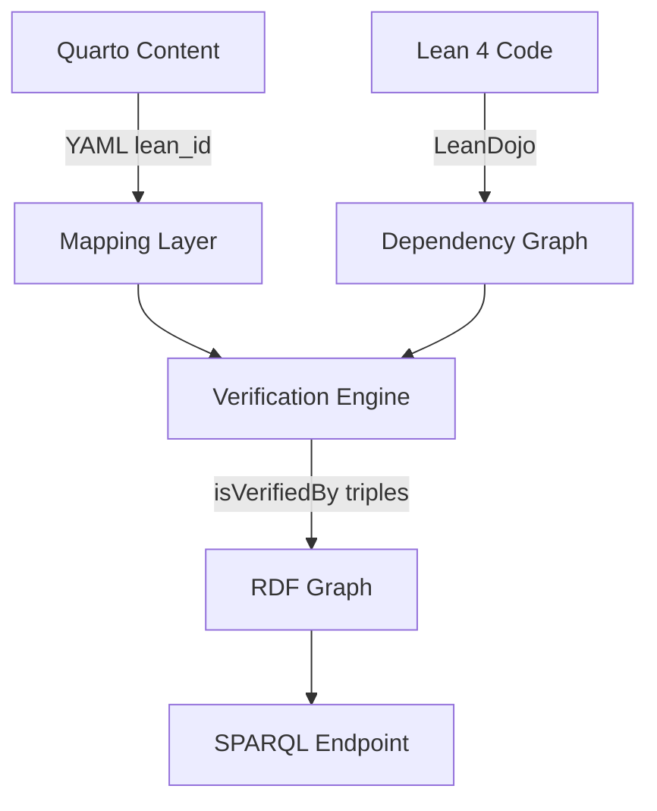

# Lean 4 Integration Plan for Math Knowledge Graph

## Overview

This document outlines the plan for integrating Lean 4 formal verification into the Math Knowledge Graph Wiki. The goal is to create a bridge between the human-readable Quarto content and formally verified mathematical proofs in Lean 4.

## Current State

- **Knowledge Graph**: 48 mathematical nodes with 80 relationships
- **Content**: Definitions, theorems, examples, and axioms across multiple domains
- **Infrastructure**: Working SPARQL endpoint, REST API, and visualizations
- **YAML Metadata**: Already includes `lean_id` field for future mapping

## Phase 1: Environment Setup (Week 1)

### 1.1 Install Lean 4 Toolchain
```bash
# Install elan (Lean version manager)
curl https://raw.githubusercontent.com/leanprover/elan/master/elan-init.sh -sSf | sh

# Verify installation
elan --version
lean --version
lake --version
```

### 1.2 Set Up VS Code Integration
- Install "Lean 4" extension from marketplace
- Configure extension settings
- Test with simple Lean file

### 1.3 Create Lean Project Structure
```bash
cd formal/
lake init mathwiki
cd mathwiki/
lake update
```

### 1.4 Add Mathlib4 Dependency
Update `lakefile.lean`:
```lean
require mathlib from git
  "https://github.com/leanprover-community/mathlib4.git"
```

## Phase 2: Basic Formalization (Week 2-3)

### 2.1 Create Mapping Strategy
- Map Quarto node IDs to Lean theorem names
- Example mapping:
  - `def-group` → `Mathlib.Algebra.Group.Defs.Group`
  - `thm-lagrange` → `Mathlib.GroupTheory.Lagrange`

### 2.2 Formalize Core Definitions
Start with basic definitions from our content:
- Set
- Binary Operation
- Group
- Topological Space
- Vector Space

### 2.3 Create Custom Theorems
For theorems not in mathlib, create our own formalizations:
```lean
-- formal/mathwiki/Basic/Group.lean
import Mathlib.Algebra.Group.Defs

namespace MathWiki

theorem unique_identity (G : Type*) [Group G] :
  ∃! e : G, ∀ a : G, e * a = a ∧ a * e = a := by
  sorry -- TODO: Add proof

end MathWiki
```

## Phase 3: LeanDojo Integration (Week 4)

### 3.1 Install LeanDojo
```bash
poetry add lean-dojo
```

### 3.2 Extract Dependencies
Create script to extract dependency graph:
```python
# scripts/extract_lean_deps.py
from lean_dojo import LeanGitRepo, trace

repo = LeanGitRepo(".", "lakefile.lean")
trace(repo, dst_dir="lean_traces/")
```

### 3.3 Parse Dependency Data
- Parse `.dep_paths` files for file-level dependencies
- Parse `.trace.xml` for theorem-level dependencies
- Convert to RDF format compatible with our ontology

## Phase 4: Bridge Implementation (Week 5-6)

### 4.1 Update Parser Script
Enhance `scripts/build_graph.py` to:
- Read `lean_id` from YAML metadata
- Query Lean dependency data
- Add `mymath:isVerifiedBy` triples for verified theorems

### 4.2 Create Verification Script
```python
# scripts/verify_lean_consistency.py
def verify_dependencies(quarto_node, lean_theorem):
    """Compare dependencies between Quarto and Lean"""
    quarto_deps = get_quarto_dependencies(quarto_node)
    lean_deps = get_lean_dependencies(lean_theorem)

    missing_in_quarto = lean_deps - quarto_deps
    missing_in_lean = quarto_deps - lean_deps

    return {
        'consistent': len(missing_in_quarto) == 0 and len(missing_in_lean) == 0,
        'missing_in_quarto': list(missing_in_quarto),
        'missing_in_lean': list(missing_in_lean)
    }
```

### 4.3 Update CI/CD Pipeline
Add Lean verification step to `.github/workflows/build.yml`:
```yaml
- name: Build Lean Project
  run: |
    cd formal/mathwiki
    lake build

- name: Extract Lean Dependencies
  run: |
    poetry run python scripts/extract_lean_deps.py

- name: Verify Consistency
  run: |
    poetry run python scripts/verify_lean_consistency.py
```

## Phase 5: Content Enhancement (Ongoing)

### 5.1 Add Lean IDs to Existing Content
Update YAML metadata in existing `.qmd` files:
```yaml
---
title: "Definition: Group"
id: "def-group"
type: "Definition"
lean_id: "Mathlib.Algebra.Group.Defs.Group"
---
```

### 5.2 Create Lean Formalization Guidelines
- Document naming conventions
- Create templates for common patterns
- Establish review process for formal proofs

### 5.3 Gradual Formalization
Priority order for formalization:
1. Core algebraic structures (Group, Ring, Field)
2. Basic topology definitions
3. Linear algebra fundamentals
4. Number theory basics
5. Advanced topics

## Integration Architecture



## Success Metrics

- Number of formally verified nodes
- Consistency rate between Quarto and Lean dependencies
- Build time for Lean verification
- Coverage of mathematical domains

## Next Steps

1. Install Lean 4 toolchain (immediate)
2. Create initial Lean project structure
3. Formalize 5-10 basic definitions as proof of concept
4. Implement dependency extraction with LeanDojo
5. Create verification pipeline
6. Update existing content with Lean IDs

## Resources

- [Lean 4 Documentation](https://leanprover.github.io/lean4/doc/)
- [Mathlib4 Documentation](https://leanprover-community.github.io/mathlib4_docs/)
- [LeanDojo Documentation](https://leandojo.readthedocs.io/)
- [Lean Community Zulip](https://leanprover.zulipchat.com/)

## Timeline

- **Week 1**: Environment setup and basic project structure
- **Week 2-3**: Initial formalizations and mathlib exploration
- **Week 4**: LeanDojo integration and dependency extraction
- **Week 5-6**: Bridge implementation and verification pipeline
- **Ongoing**: Content enhancement and gradual formalization
